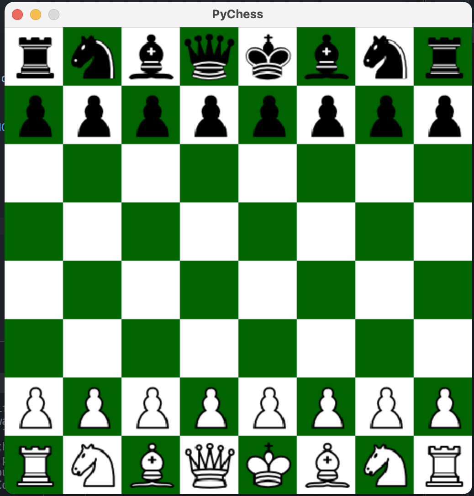

# college_admissions_portfolio
A compiltation of past coding projects

## ETH Hodl Contract [[EthHodl](EthHodl)]
This is a blockchain smart-contract that is deployed on the ethereum testnet at  
This contracts help you HODL (Hold on for dear life) your tokens by putting a time-based lock mechanism for tokens stored at the address 

## Python Chess [[Chess](chess)]
This is a classic game of chess, written in Python, using Object-orientated programming principles and the Pygame library

